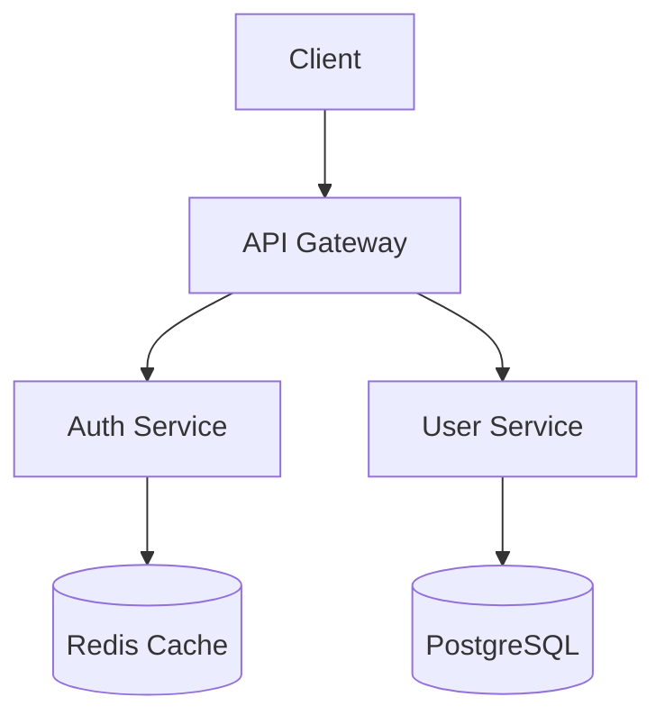

# Architecture Diagram Generator

Generate visual architecture diagrams in Mermaid syntax by analyzing your codebase structure.

## Overview

This skill analyzes your project's file structure, imports, and dependencies to produce:

- **System Architecture** - High-level component diagram
- **Data Flow** - Request/response paths through the system
- **Dependency Graph** - Module and package relationships
- **Database Schema** - Entity relationship diagrams

## How It Works

1. Scans your project structure and key files
2. Identifies components, services, and their relationships
3. Generates Mermaid diagram code
4. Outputs to a markdown file or clipboard

## Example Output

## Usage

Invoke with: "Generate an architecture diagram for this project"

Specify diagram type:
- "Show me the data flow diagram"
- "Generate an ER diagram for the database models"
- "Create a dependency graph of the modules"
